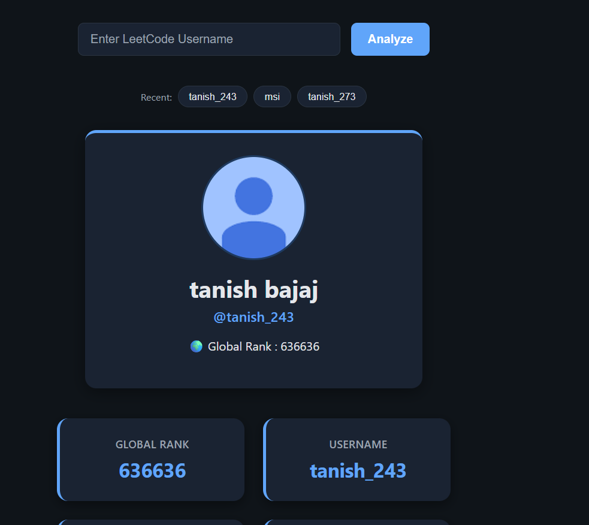
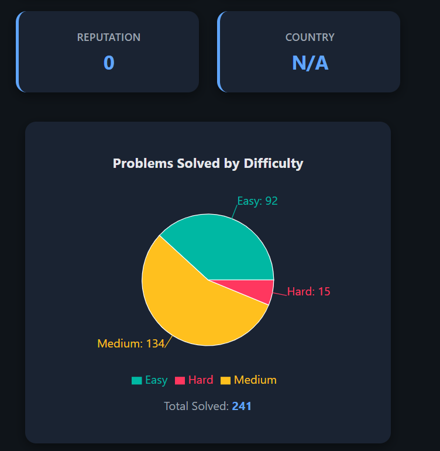
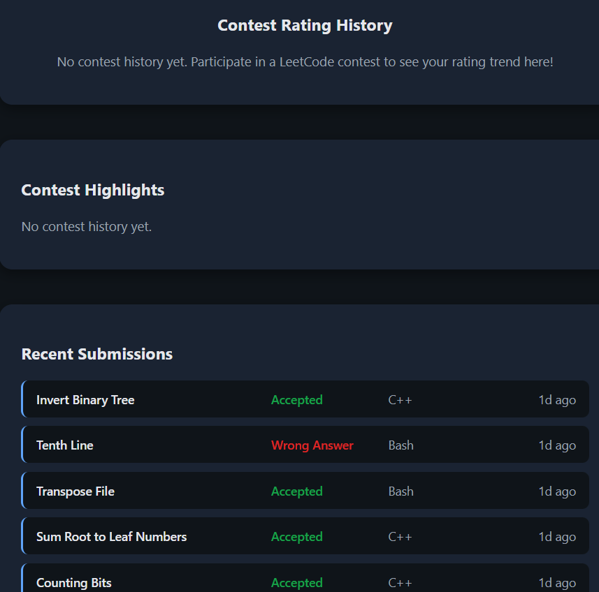
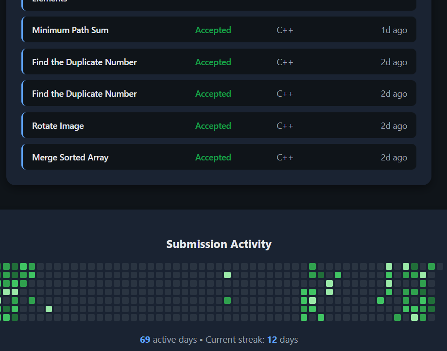
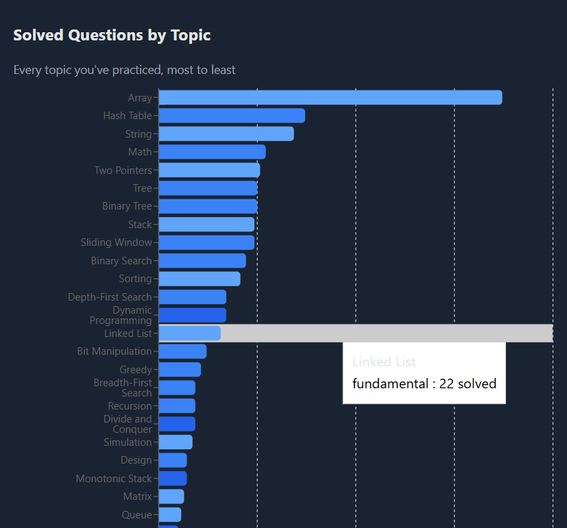
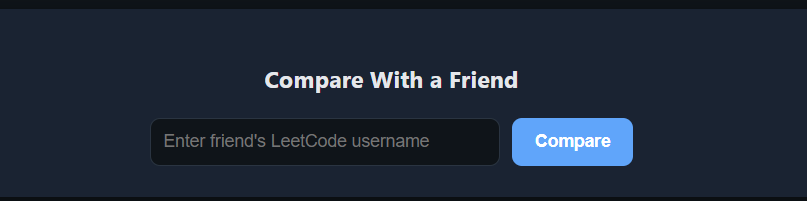

# LeetCode Insight

A full-stack analytics dashboard that transforms your raw LeetCode profile data into rich, visual insights — contest rating trends, topic strengths and weaknesses, submission activity, and more.



---

## ✨ Features

- **Profile Overview** — avatar, global rank, reputation, and country at a glance
- **Difficulty Breakdown** — pie chart of Easy / Medium / Hard problems solved
- **Contest Rating History** — line chart tracking rating progression across every contest attended
- **Contest Highlights** — best rank achieved, peak rating, biggest single-contest rating jump, and a list of recent contests with unsolved problems
- **Recent Submissions** — the last 20 submissions with status, language, and relative time
- **Submission Heatmap** — a GitHub-style calendar showing daily solving activity, streak, and total active days
- **Weak Topic Detection** — surfaces the least-practiced topics so you know where to focus next
- **Topic Distribution Chart** — full bar chart of problems solved across every topic (Arrays, DP, Graphs, etc.)
- **Friend Comparison** — search a second username and compare stats side-by-side
- **Search History** — quick-access chips for your last 5 searched usernames
- **Dark Mode** — toggleable theme with persistent preference
- **Responsive Design** — works cleanly on desktop, tablet, and mobile
- **Loading Skeletons** — smooth shimmer placeholders while data loads

---

## 🖼️ Screenshots

**Profile, Search History & Difficulty Breakdown**




**Contest Highlights & Recent Submissions**



**Submission Heatmap**



**Weak Topic Detection**


**Topic Distribution (Full Bar Chart)**



**Friend Comparison**



---

## 🛠️ Tech Stack

**Frontend**
- React (Vite)
- Axios — API requests
- Recharts — charts and data visualization
- Lucide React — icons
- CSS custom properties for theming (light/dark mode)

**Backend**
- Node.js + Express + TypeScript
- Integrates with LeetCode's public data to serve structured REST endpoints (profile, solved stats, contest history, submissions, calendar, skills)

---

## 📂 Project Structure

```
leetcode-insight/
├── backend/                  # REST API server
│   └── src/
└── frontend/                 # React + Vite client
    └── src/
        ├── components/       # Reusable UI components (charts, cards, etc.)
        ├── pages/
        │   └── Dashboard.jsx
        ├── services/
        │   └── api.js         # Centralized API calls
        └── css/
            └── dashboard.css  # Design tokens + all component styles
```

---

## 🚀 Running Locally

### Prerequisites
- Node.js (v18 or higher recommended)
- npm

### 1. Clone the repository

```bash
git clone https://github.com/tanish05-hub/leetcode-insight.git
cd leetcode-insight
```

### 2. Start the backend

```bash
cd backend file name 
npm install
npm run dev
```

The backend will start at `http://localhost:3000`.

### 3. Start the frontend

Open a **new terminal window**, then:

```bash
cd frontend file name 
npm install
```

Create a `.env` file in the `frontend` folder:

```
VITE_API_URL=http://localhost:3000
```

Then run:

```bash
npm run dev
```

The frontend will start at `http://localhost:5173`. Open that URL in your browser.

### 4. Try it out

Search any valid LeetCode username (e.g. `tanish_243`, `uwi`) in the search bar to see their full analytics dashboard.

---

## 🌐 Live Demo

- Frontend: [your-vercel-url-here]
- Backend API: [your-render-url-here]

---

## 📈 What I Built / Learned

This project was built to practice full-stack development with a real-world data source:

- Designing a modular, component-based React architecture (10+ reusable components)
- Working with async data fetching, loading/error states, and derived UI states
- Building custom data visualizations with Recharts (pie, line, bar charts, and a custom heatmap grid)
- Implementing a CSS custom-properties-based theming system for dark mode
- Managing client-side persistence with `localStorage` (theme preference, search history)

---

## 📄 License

This project is for educational and portfolio purposes.
